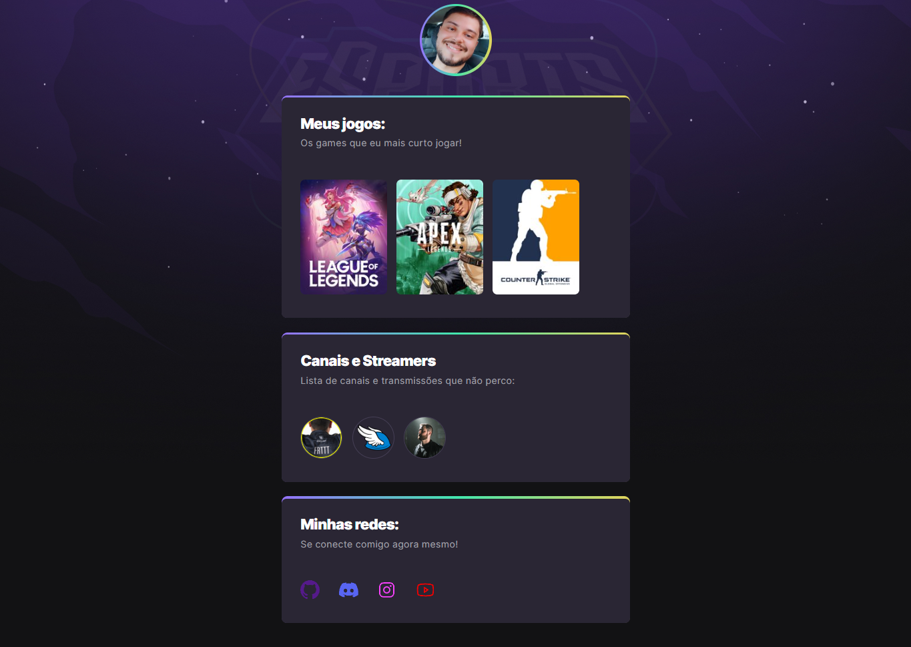

# NLW-Esports 

> Trilha Explorer

Projeto construído no evento: 
    Next Level Week da Rocketseat.

[Clique aqui para acessar 🔗]
(https://kiltten.github.io/NLW-Rocketseat/)

## 🔨 Tecnologias: 

- HTML
- CSS
- Git & Github

## 👨🏻‍🎓 O que aprendi:

- HTML e CSS acabavam por si só me desanimando, pois achei que nunca conseguiria aprender ou fazer algo básico que fosse. 
Portanto, foi uma ótima experiência realizar esse projeto e aprender à subi-lo para que outras pessoas possam acessar, e ver assim o meu esforço e aprendizado. 
Sou MUITO grato ao NLW, e é apenas o meu primeiro! 🥰

## ✉️ Contato:

dougmndc@hotmail.com

    